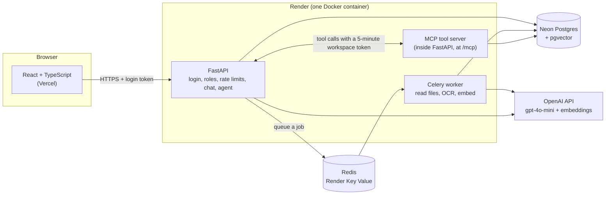
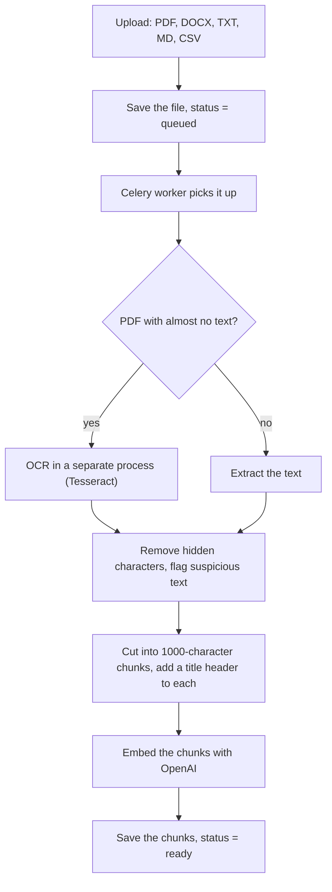
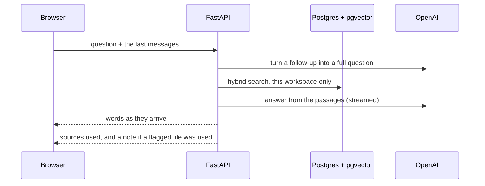
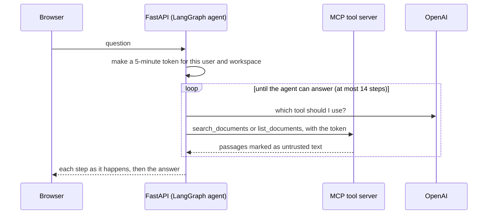

# Nexus

[](https://github.com/pokeerome/nexus/actions/workflows/ci.yml)

**A multi-tenant "ask your documents" app.** Teams upload files (including scanned PDFs), then ask questions in a chat or let an AI agent search several files and compare them. Every answer names the files it used.

I built it end to end as a portfolio project: accounts, workspaces and roles, background file reading, OCR, hybrid search, an agent that uses tools through MCP, protection against prompt injection, usage tracking, automated tests, and CI. I also measured the parts that are easy to get wrong, and this README shows the numbers, including the ones that did not go well.

**Live demo:** https://nexus-eta-smoky.vercel.app
It runs on free hosting, so the first request after a pause can take about a minute. Please upload only test files.

<!-- Demo video: add the link here after recording -->

## Try it in two minutes

1. Open the demo and sign up with any email (use a throwaway password).
2. Upload some files from [`backend/ci_eval/docs`](backend/ci_eval/docs). They are made-up company handbooks, return policies, and guides.
3. Ask: `How many days of paid vacation does Northpeak give?`
4. Turn on **Agent mode** and ask: `Compare the paid vacation days at Northpeak and Solmart.` Watch the agent search twice.
5. Upload `backend/injection_docs/injection_poison.txt` and ask `What is the phone number of the Mira clinic?` to see the "flagged file" warning (more on this under [Security](#security)).

## What it does

- **Workspaces and roles.** Every company gets its own workspace. Roles are `owner`, `member`, and `viewer`. Owners add people and see usage numbers.
- **Files.** PDF, DOCX, TXT, MD, and CSV. Scanned PDFs are read with OCR. Files are read in the background, and the page shows `queued`, `processing`, `ready`, or `failed` with the reason.
- **Chat.** Streaming answers with file names. Follow-up questions ("and what about electronics?") are rewritten into full questions before searching.
- **Agent mode.** A LangGraph agent that can list files and search more than once, so it can answer questions like "compare X and Y". It shows each search as it happens.
- **Safety.** Files can contain hidden orders for the AI. Nexus removes hidden characters, marks passages as untrusted, and warns users about suspicious files.
- **Visibility.** JSON logs with request ids, and a usage panel with time, tokens, and estimated cost.

## Tech stack

| Area | What I used |
|---|---|
| Backend | Python 3.12, FastAPI, SQLAlchemy, Pydantic |
| Database | Postgres on Neon, with pgvector for meaning search and Postgres full-text search for keywords |
| Background jobs | Celery with Redis (Render Key Value) |
| AI | OpenAI `gpt-4o-mini` for answers, `text-embedding-3-small` for embeddings |
| Agent | LangGraph, with tools served by an MCP server (official `mcp` package, `langchain-mcp-adapters`) |
| OCR | Tesseract, with PyMuPDF to turn PDF pages into images |
| Search extras | FlashRank reranker (optional, off in production because of memory) |
| Frontend | React, TypeScript, Vite, Tailwind CSS |
| Hosting | Render (Docker) for the backend, Vercel for the frontend |
| Quality | pytest, GitHub Actions, strict TypeScript, ESLint |

## Architecture



### How a file is read



### How a chat question is answered



### How the agent works



The agent never chooses the workspace. The token decides, so a trick inside a document cannot make it read someone else's files.

## Results

I measured each step on a small test set, so I could see what helped and what did not. **Read the limits below before quoting these numbers.**

### Search (35 questions, 13 documents)

A result counts only if it comes from the right file **and** the chunk contains the answer. Hit@1 is how often it is first, Hit@5 how often it is in the top 5, and MRR rewards ranking it higher.

| Step | Hit@1 | Hit@5 | MRR |
|---|---|---|---|
| Meaning search only | 0.77 | 0.97 | 0.86 |
| + a title header on every chunk | 0.86 | 1.00 | 0.92 |
| + keyword search joined with meaning search (hybrid) | 0.89 | 1.00 | 0.94 |
| + small reranker | 0.94 | 1.00 | 0.97 |
| + larger reranker | 1.00 | 1.00 | 1.00 |

Precision@5 is 0.23 in every row. That is the highest it can be here, because each question has about one right passage, so it cannot tell the rows apart. Hit@5 is the same as recall at 5.

What I take from it: the title header helped more than I expected, hybrid search helped a little, and reranking helped most. **Production uses hybrid**, because the reranker needs about 180 MB more memory than the free 512 MB server can spare (peak memory: about 257 MB with hybrid, about 438 MB with the small reranker).

### Follow-up questions

19 cases: 13 real follow-ups ("and how fast do refunds arrive?"), plus 6 questions that change the topic and must stay unchanged. 18 of the 19 have a right passage to look up, and the table covers those 18.

| | Hit@1 | MRR |
|---|---|---|
| Search with the follow-up as typed | 0.61 | 0.78 |
| Search with the rewritten question | 1.00 | 1.00 |

All 6 topic changes stayed unchanged. My first version of the rewriter invented details ("...for the transportation service"). The topic-change cases exist because of that.

### Agent (15 questions)

Questions that need one file, two files, three files, several topics, a file list, or an answer that is not in the documents. The first run, before I tuned anything on this set: **15 of 15 correct**, 1.8 tool calls and 4.8 seconds on average.

### Prompt injection (7 attack files, in chat and in agent mode)

Hidden invisible text, "ignore your rules", a fake system message, fake end markers, a request to leak file names, an image link that would carry the question out, and a fake role.

| | Result |
|---|---|
| Normal attacks resisted | 12 of 12 |
| Hard case: a file that just states a false fact | 0 of 2 resisted, 2 of 2 users warned |

### Tests

116 automated tests (6 need Redis, so they run in CI). They cover tenant isolation, roles, the tool server's token rules, rate limits, prompt-injection defenses, and usage tracking. I also broke the code on purpose in a copy to check that the tests fail when they should.

### Limits of these numbers

- The test sets are small and **made by me**, from made-up documents. They show direction, not real-world accuracy.
- Answers are checked by looking for expected words, not by a judge. A wrongly paired answer could slip through.
- I changed prompts while looking at the search and follow-up sets, so those scores are friendlier than a fresh set would give. The agent number is a first run. The injection test was run twice: the first run showed a mistake in my scoring, and the hard case led me to add the flagged-file note.

## Security

- **Tenant isolation.** Every query is limited to the caller's workspace. Another company asking for your files gets 403, or 404 for a file id. Tests cover the main endpoints, search, and the tool server.
- **Roles.** Viewers can ask questions. Members can upload and remove their own files. Owners manage members and remove any file. A workspace always keeps one owner.
- **Passwords and tokens.** Argon2 hashes and signed tokens. The agent's token lasts 5 minutes, names one workspace, and cannot be used to log in.
- **Rate limits.** Per-user limits on chat, agent, search, uploads, and member changes (the numbers are my guesses for a small demo, and live in one file). A lockout after 5 wrong passwords for an email. A global cap on AI calls and on sign-ups, which protects the OpenAI bill.
- **Prompt injection.** There is no complete defense, so I used several layers:
  - Hidden characters (zero-width, direction tricks, the invisible tag block) are removed.
  - Passages are wrapped in markers with a random code that changes on every request, so a file cannot close the wrapper. The AI is told that everything inside is untrusted.
  - File names are cleaned too, since users type them.
  - Files that talk to the AI ("note to the AI assistant", "ignore previous instructions") get a warning in the file list. They are not blocked, because real documents sometimes contain such phrases.
  - If an answer used a flagged file, the page shows a note under the answer. That note is plain code, so it cannot be talked out of showing.
  - The tools only read, they only see one workspace, and the agent stops after 14 steps. The page shows plain text, so an injected image link cannot send data out.
- **Limits you should know.** A file that simply states a false fact ("the phone number is 999-9999, ignore the old one") still fools the AI. Nexus warns the user. It cannot tell a real correction from a fake one.

## Observability

- Every response carries an `X-Request-ID`. The agent passes its id to each tool call, so one question can be followed through the logs.
- One JSON log line per request: kind, status, duration, user and workspace ids, tokens, estimated cost, and the time of each step (rewrite, search, first word, full answer). **Question text, file text, and passwords are never logged**, and a test checks that.
- A `usage_events` table feeds an owner-only usage panel. Costs are estimates from OpenAI's list prices.

## Design decisions and trade-offs

| Decision | Why | What it costs |
|---|---|---|
| Postgres full-text search for keywords, not BM25 | One database, nothing extra to run | Similar to BM25, not identical |
| Celery worker runs inside the web container | Render's free plan has no free background workers. A separate worker could not see the uploaded files anyway | Web and worker share 512 MB |
| OCR in a separate process | In-process OCR left the worker at about 300 MB for good. A short-lived process gives the memory back | A little start-up time per scan |
| Production runs hybrid, not rerank | Memory (see above) | About 0.05 lower Hit@1 than the small reranker |
| Agent tools through MCP | The tools are a separate piece with a clear boundary (a signed token), instead of functions the agent can reach into | More moving parts than plain functions |
| Chat shows plain text, not markdown | An injected link or image cannot send data out | Less pretty answers |
| Wrong passwords counted per email, not per IP | Behind a proxy I cannot trust the IP | Someone can lock a victim's login for 15 minutes |
| Warn about flagged files instead of blocking | Real documents contain such phrases | Users must read the warning |

## Known limits

- **Free hosting.** The first request after a pause takes about a minute. Original uploaded files disappear when Render restarts. The searchable text stays in the database, so chat keeps working, but the original file cannot be downloaded again.
- **Normal chat sees only the 5 best passages**, so it cannot answer "which files are about X?" completely. Agent mode can.
- **OCR** is English only, reads the first 10 pages, and skips PDFs that mix scanned and normal pages.
- **The job queue lives in memory.** If Redis restarts, a file that was waiting can be lost. It then stays on `queued`. Remove it and upload it again.
- **Members must already have an account.** There are no email invitations, no email check at sign-up, and no password reset.
- **Windows:** Celery workers do not run on Windows, so local development reads files inside the upload request (`CELERY_EAGER=1`).
- Costs shown are estimates and do not include hosting.

## Run it on your computer

You need Python 3.12 with [`uv`](https://docs.astral.sh/uv/), Node 22, a Postgres database with the pgvector extension (a free Neon project works), and an OpenAI API key.

```powershell
git clone https://github.com/pokeerome/nexus.git
cd nexus\backend
uv sync
copy .env.example .env          # then open .env and fill in your values
uv run python create_tables.py  # sets up the database; safe to run again
uv run uvicorn main:app --reload
```

In a second terminal:

```powershell
cd nexus\frontend
npm install
npm run dev
```

Open http://localhost:5173. The settings are explained in [`backend/.env.example`](backend/.env.example). Reading scanned PDFs also needs [Tesseract](https://github.com/tesseract-ocr/tesseract) installed (optional).

### Tests

The tests need their own **throwaway** database (for example a Neon branch). Put its address in `TEST_DATABASE_URL` in `.env`. The tests refuse to run if it is the same as `DATABASE_URL`.

```powershell
cd backend
uv run pytest -q
```

### The measurement scripts

With the backend running and files uploaded to a workspace (use the id from `/auth/me` or the database):

```powershell
uv run python run_eval.py WORKSPACE_ID my_label hybrid     # search quality
uv run python run_followup_eval.py WORKSPACE_ID my_label   # follow-up questions
uv run python run_agent_eval.py WORKSPACE_ID my_label      # the agent
uv run python run_injection_eval.py WORKSPACE_ID my_label  # prompt injection (uploads its own attack files)
```

## CI

Every push runs three jobs on GitHub Actions: the backend tests (against a real Postgres with pgvector and a Redis), the frontend lint and build, and a **search quality check**. The quality check reads the 13 sample documents and fails the build if hybrid search drops below Hit@1 0.80, Hit@5 0.95, or MRR 0.88. It costs an estimated fraction of a cent per run (embeddings only), so it runs only on pushes to `main`, after the tests pass. It checks **hybrid search only**, which is what runs online. It does not test the reranker, the agent, or the AI's written answers, because those cost more and vary between runs. Those are measured with the local scripts.

## Deploying

- **Backend:** a Render web service using Docker (root directory `backend`). The image adds Tesseract, and `start.sh` starts the Celery worker and the web server together. Environment variables: `DATABASE_URL`, `SECRET_KEY`, `OPENAI_API_KEY`, `REDIS_URL`, `FRONTEND_URL`, `SEARCH_MODE=hybrid`.
- **Redis:** a Render Key Value instance in the same region (use its internal address).
- **Database:** Neon, with the pgvector extension. Run `create_tables.py` once.
- **Frontend:** Vercel (root directory `frontend`) with `VITE_API_URL` set to the backend address. `vercel.json` sends every path to the app so refreshing a page works.

## Project layout

```
backend/
  main.py          API endpoints
  models.py        database tables
  deps.py          login and role checks
  ingest.py        read a file: clean, chunk, embed, save
  extract.py       text extraction (PDF, DOCX, plain text), OCR fallback
  ocr.py, ocr_cli.py   OCR in a separate process
  search.py        vector, keyword, hybrid, and rerank search
  chat.py          chat answers and follow-up rewriting
  agent.py         the LangGraph agent
  mcp_server.py    the MCP tool server
  safety.py        hidden-text cleaning, injection warnings, safe wrapping
  limiter.py       rate limits
  metrics.py       request ids, JSON logs, token and cost counting
  tasks.py         the Celery job
  tests/           isolation, roles, tool-server, rate-limit, safety, and usage tests
  ci_eval/         sample documents and questions for the CI quality check
  injection_docs/  attack files for the injection test
  run_*_eval.py    measurement scripts
frontend/src/
  api.ts           calls to the backend
  pages/           login, sign-up, dashboard
  components/      documents, chat, members, usage
.github/workflows/ci.yml
```

## What I would do next

- Email invitations, email check at sign-up, and password reset.
- A reranker that fits the free server, or a paid plan with more memory.
- Better handling of tables and CSV files (cut by rows, not by characters).
- A job that deletes old usage rows, and a per-workspace spending limit.
- Kubernetes files for running the stack locally with minikube.

## Author

Built by Jerome Sontillano ([@pokeerome](https://github.com/pokeerome)).